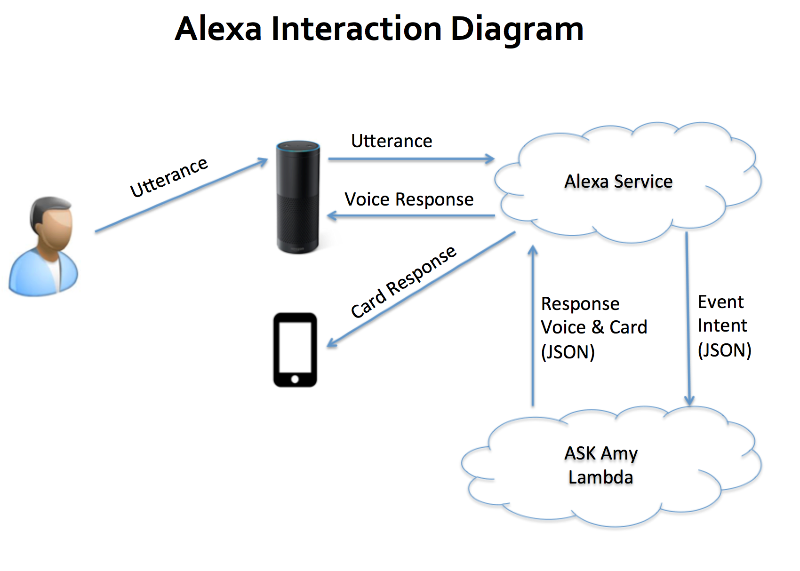
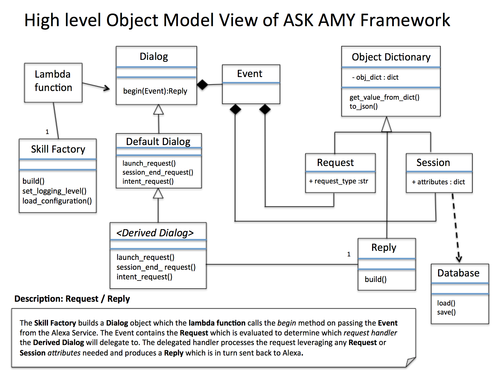
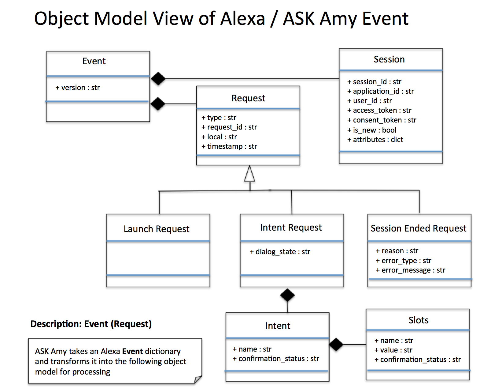
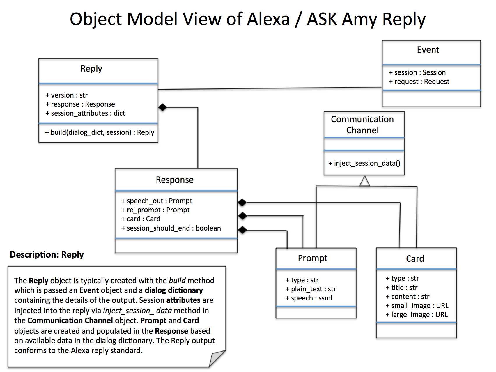

ASK Amy Overview
================

This document is meant to give a high-level overview of the ASK Amy model.

.. note::

    In the below model a number of advanced objects and utility features are left out intentionally to help provide
    emphasise on the fundamental concepts.

Alexa Interaction Diagram
--------------------------
Figure 1.

    Figure 1.

ASK Amy Framework
-------------------
Figure 2. Shows the high-level object model. It is important to note that although the model greatly simplifies the
use of the Event dictionary that is sent from the Alex Service, the developer always has complete access to this data
if needed.

    Figure 2.

Alexa Event Model
^^^^^^^^^^^^^^^^^

Figure 3.

    Figure 3.

Alexa Reply Model
^^^^^^^^^^^^^^^^^

Figure 4.

    Figure 4.
