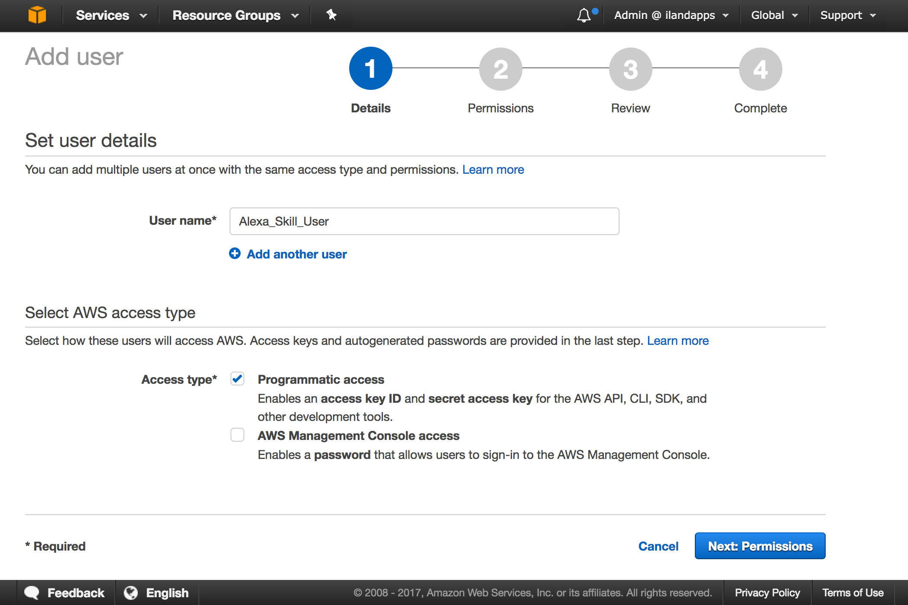
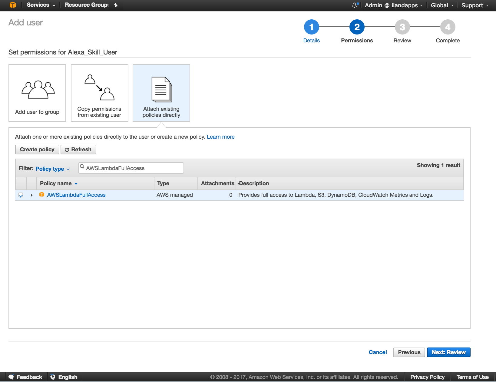
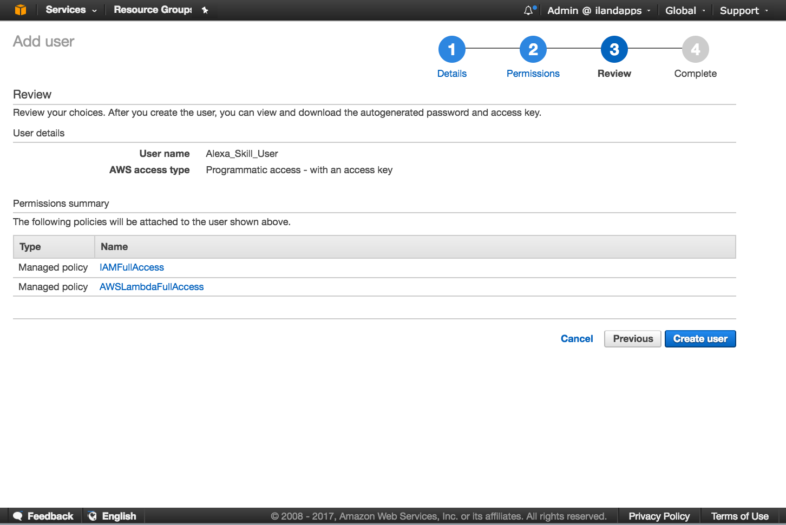
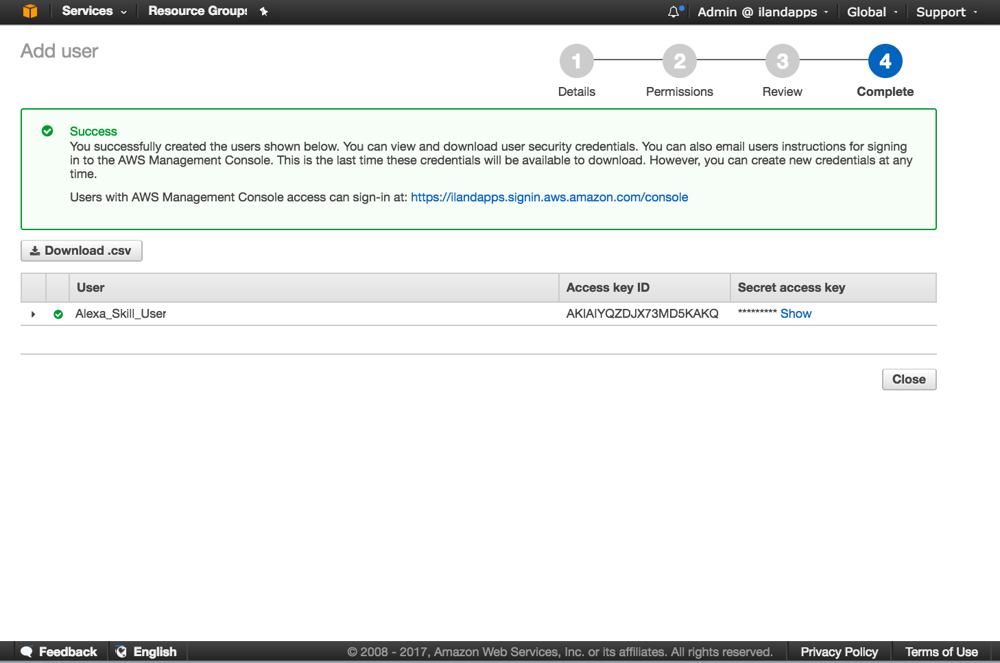

Prerequisites
=============

.. sidebar:: *Expected Time 25 Minutes*

   If you have a functioning Python 3.+ environment and are familiar with executing at the command line expect to spend
   approximately 25 Minutes to install and configure the prerequisites described below. This estimate includes the time
   to create and secure the two Amazon accounts.

|prereq| Before diving in, there are a few prerequisites that must be satisfied. Happily, once these requirements are
satisfied, we can focus on coding our Alexa Skills and not concentrate the environment. Let’s get started.

Users Accounts
--------------

* We will need an `Amazon Developer account <https://developer.amazon.com/>`_ to design and deploy our skills *voice user interface*.
* An `AWS (Amazon Web Services) Account <https://aws.amazon.com/>`_ to deploy our skills *execution code* (we will be deploying on `AWS Lambda <https://aws.amazon.com/lambda/>`_).

.. seealso::

    Additional beneficial reading on getting started with Alexa Skill development can be found here with
    the `Amazon provided documentation <https://developer.amazon.com/public/solutions/alexa/alexa-skills-kit/docs/requirements-to-build-a-skill>`_.

.. note::

    The AWS Account creation will require a *credit card* however the **Free Tier** will be more than sufficient for
    getting started with all our Alexa Skills.

    Also **note** that although not strictly required it is a best practice to secure your `AWS Root account
    <http://docs.aws.amazon.com/IAM/latest/UserGuide/id_root-user.html>`_.

Pip Installs
------------

Once we have our accounts setup the next step is to :ref:`install-ask-amy-label`, for those with a Python 3.+
environment already configured for development this should be a very simple process of calling `pip install ask_amy`.

.. code-block:: bash

   $ pip install ask_amy

The next prerequisite is setting up integration with **Amazon Web Services**. Our primary integration tool will be the
**AWS CLI** (Command Line Interface) which should also be a simple install if you have a fully functioning Python 3.+
environment.

.. code-block:: bash

    $ pip install --upgrade --user awscli

.. note::

  Additional Amazon CLI documentation can be found here:

  * `CLI installation <http://docs.aws.amazon.com/cli/latest/userguide/installing.html>`_

  * `CLI configure <http://docs.aws.amazon.com/cli/latest/userguide/cli-chap-getting-started.html>`_

Add AWS User
------------

With AWS CLI installed we now need to configure the environment to work with ASK Amy. We will need to create an AWS user
that can support our development needs. To do so login to the **AWS Console** with a user who's credentials are capable
of creating additional *Users*.

Navigate to the `IAM Add user page <https://console.aws.amazon.com/iam/home#/users$new?step=details>`_

01 Add
^^^^^^

Fill in **User name** *Alexa_Skill_User* and select **Programmatic Access** and click **Next:Permissions**

|user_add|

02 Permissions
^^^^^^^^^^^^^^

For **Permissions** select **Attach Existing Policies Directly** use the **Filter Policy Type** search field select
*AWSLambdaFullAccess* and *IAMFullAccess* for the Policies. These permissions can be modified later based upon need
however the initial settings should provide sufficient access without opening the permissions to wide.
Select **Next:Review**

|user_permissions|

.. note::

    IAM Policy administration is a complex subject and more advanced users may choose to further restrict the
    IAM Policies by creating an **inline policy** with the below definition or choose other more advanced
    techniques for administering policies that are beyond the scope of our current needs and this documentation.

.. code-block:: json

    {
    "Version": "2012-10-17",
        "Statement": [
            {
                "Effect": "Allow",
                "Action": [
                    "iam:CreateRole",
                    "iam:AttachRolePolicy"
                ],
                "Resource": "*"
            }
        ]
    }

03 Review
^^^^^^^^^

Review the selections ensure that the *permissions* and *AWS access type* are correct and click **Create User**

|user_review|

04 Complete
^^^^^^^^^^^

Select **Download .csv** and save the file to a secure location on you local device.

|user_complete|

AWS CLI Configure
-----------------

With our newly created user we are now ready to configure the **AWS CLI environment**. To do so enter a *command shell* and type
`aws configure`. If this is your first time executing aws configure it will look similar to the below shell window.
Open the credentials .cvs file that we downloaded in the last step and copy and paste the *Access Key ID* and
*Secret Access Key* into the appropriate prompts. select *us-east-1* for your default region and *text* as the default
output format.

.. code-block:: bash

   $ aws configure
   AWS Access Key ID [None]: ***************
   AWS Secret Access Key [None]: ***************
   Default region name [None]: us-east-1
   Default output format [None]: text

.. _aws-lambda-role-label:

AWS Lambda Role
---------------

Our final configuration step will be to create a Role for our Alexa Skills to assume when they are executing. This role
will provide permission to *DynamoDB* and *Cloudwatch Logs*. You can create the Role by executing the following command
`ask-amy-cli create_role --role-name alexa_skill_role`. The output should look similar to the below shell window.

.. code-block:: bash

   $ ask-amy-cli create_role --role-name alexa_skill_role
   {
        "iam_create_role": {
            "Role": {
                "RoleName": "alexa_skill_role",
                "Arn": "arn:aws:iam::280056172273:role/alexa_skill_role",
                "Path": "/",
                "AssumeRolePolicyDocument": {
                    "Version": "2012-10-17",
                    "Statement": [
                        {
                            "Effect": "Allow",
                            "Principal": {
                                "Service": "lambda.amazonaws.com"
                            },
                            "Action": "sts:AssumeRole"
                        }
                    ]
                },
                "RoleId": "AROAI4NG2EMC5HHRBYID4",
                "CreateDate": "2017-07-22T14:59:57.594Z"
            }
        },
        "iam_attach_policy_cloud_watch": {},
        "iam_attach_policy_dynamo": {}
    }

.. note::

    Take note of the *arn:aws:iam::**********73:role/alexa_skill_role* we will need this **ARN (Amazon Resource Name)**
    later when configuring our skills for deployment

Congratulation!!
----------------
Congratulations you now have a fully configured **ASK Amy** environment and you are ready to accelerate your coding of
Alexa Skills!

.. |prereq| image:: _static/icon-prereq.png
            :width: 40px
            :height: 30px
            :align: middle

